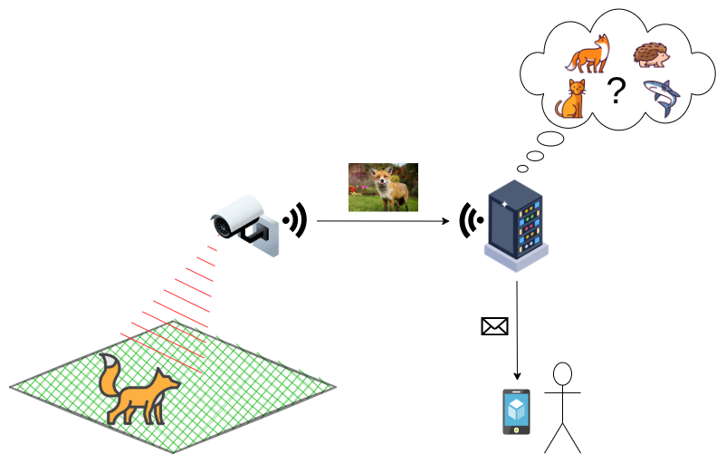

# Fauna-Eye

Fauna-Eye is a wildlife observation system for my backyard. It detects
movement, captures images, identifies animal species, and sends notifications.

## About

Once, in the mid of the night, I saw a fox staring trough our terrace toor for a
brief moment before it rushed off. When I told my wife the next day, we got very
curious which animals visit our garden (everyone is welcome, except snails and
mosquitoes). I then came up with the plan to build my own wildlife observation
system.

## Roadmap

### Stage 1

- [x] Setup Hardware
- [x] Capture Image with the camera
- [ ] Trigger image from motion sensor
- [x] Provide upload service
- [ ] Transmit image to server
- [ ] Persist images and metadata
- [ ] WebUI to show and manage images
- [ ] Send notifications
- [ ] Queue uploads when not connected

### Stage 2

- [ ] Identify species using WEB-API
- [ ] Identify species using local model
- [ ] Use specied information to filter notifications
- [ ] Show species information in WebUI

### Stage 3

- [ ] Add a microphone
- [ ] Record bird voices
- [ ] Recognize bird species (BirdNET)
- [ ] Extend notifications
- [ ] Build a proper hardware case

## Get Started

1. Checkout this repository

### Run the server locally

1. > docker compose -f develop/compose.yml up  

On the first run this will also build the application.

### Run the wildcam on a raspberry Pi

1. Enable [SPI](https://www.raspberrypi.com/documentation/computers/configuration.html#spi)
2. Checkout this repository or copy the wildcam onto the Pi
3. > sudo apt install python3-picamera2 python3-gpiozero python3-luma.oled
4. > python wildcam/main.py

## Documentation

[Architecture](docs/architecture.md)

## License

[MIT License](LICENSE)
